## Introduction

Imagine your PI returns from a conference where they attended a talk about Sorghum. They know that [this paper](https://link.springer.com/article/10.1186/s12870-025-06077-w#Tab2) has the information about the proteins of interest, and would like you to characterise the proteins the authors found. They are also interested in whether there are homologs of these proteins in your species of interest.

For this example we will use the first entry in the table, `Sobic.001G439400`. Please select a different one for yourself.

## What We Will Do

### Get the sequence from the names in the paper

We know that the genome that was queried is hosted on [Phytozome](https://phytozome-next.jgi.doe.gov), hosted by the Joint Genome Institute. There are several Sorghum accessions available, and we don't know which one the authors used. 

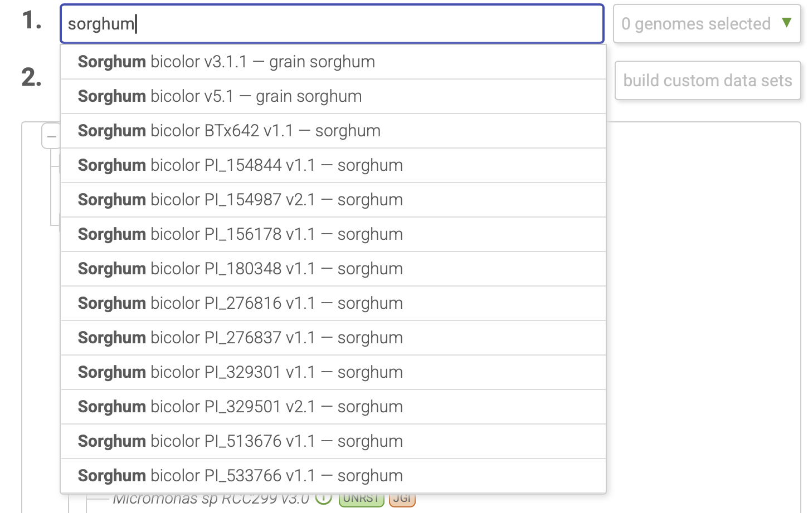

We could search each of them one by one, or we could search the whole database. First, we need to define the search parameters (which genome/genus/family etc we wish to search, defined by `Option 1`. You can type in the search box, or select on the phylogenetic tree below.) 

Once we have narrowed down the genomes we will search, we need to select the kind of search we will conduct. In this case, we know the gene name, so we will do a keyword search. If you had the sequence already and wanted to find similar sequences, you would perform a BLAST search here.

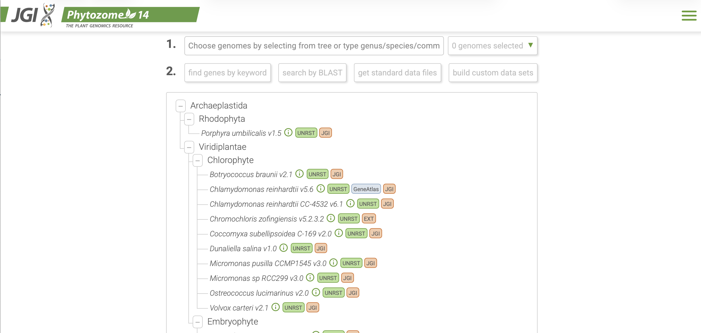

::: {.callout-tip}
You don't have to have full gene names to use the keyword search. You can search gene families, InterPro terms, and any other kind of keywords included in the annotation of genomes here
:::

We can see that there are two Sorghum accessions that contain a gene with the name `Sobic.001G439400`. v3.1.1 was released in 2017 while v5.1 was released more recently, and sequenced with PacBio. We will consider the sequences from v5.1 based on this information on the [Organism Information Page](https://phytozome-next.jgi.doe.gov/info/Sbicolor_v5_1).

>Sorghum bicolor is a JGI Plant Flagship genome known for its use as a biofuel crop and potential cellulosic feedstock. Due to its designation as a Flagship Plant, we are continuing to improve the genomic resources of the sorghum reference. This release, V5.1, is a wholly resequenced genome applying PacBio long read data. The annotation is an update that uses all the V3.1 resources, but with additional RNA-seq from JGI projects and full-length transcripts included to further improve the completeness of the gene set. 

The `B` tab in the search results takes you to a genome browser, [JBrowse](https://phytozome-next.jgi.doe.gov/jbrowse/index.html?data=genomes%2FSbicolor_v5_1&loc=Chr01%3A75891221..75899430&tracks=Transcripts%2CAlt_Transcripts%2CPASA_assembly%2CBlatx_Grass%2CBlastx_protein%2CRNAExpression&highlight=), that may be interesting in some cases to see similarity between other species in the Phytozome database. We will use the `G` tab to get to the [Gene Report](https://phytozome-next.jgi.doe.gov/report/gene/Sbicolor_v5_1/Sobic.001G439400).

The `Gene Report` has a lot of really great information about your gene of interest! It has a JBrowse interface at the top, functional annotations, and a list of all protein homologs contained within the Phytozome database.

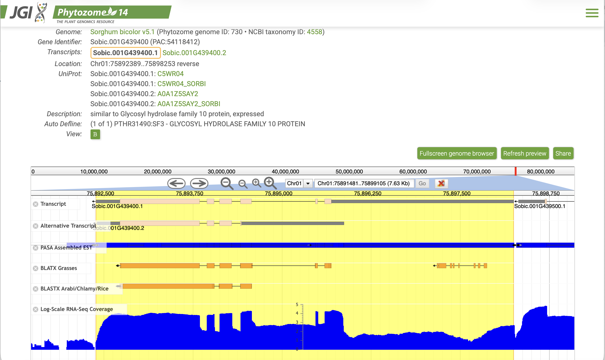

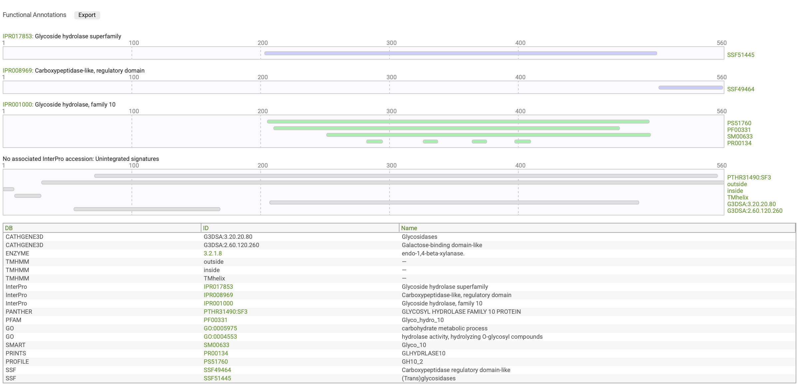

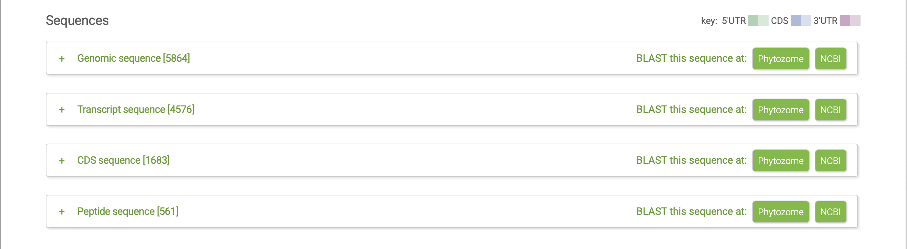

::: {.callout-important}
When you download sequences, save them in `.fasta` or `.fa` format and only open them in VSCode, Notepad, or some other kind of text editor. Please **do not** open these files in Word or other Office software. These kinds of programs often place hidden characters at the end of lines that can make an analysis fail due to illegal/unexpected characters.

Bioinformatics software expects ATGCN (and U) when working with DNA and RNA data, and the 20 amino acids (and sometimes an asterisk to symbolise a stop codon). If something else is present outside of the fasta header, more often than not, there will be an error
:::

### Finding homologs

We can use the information from the `Gene Report`to collect protein homologs from species hosted on Phytozome. At this time, there were 439 accessions on Phytozome, but many more on NCBI. From the `Gene Report` you can directly perform a BLAST on NCBI.

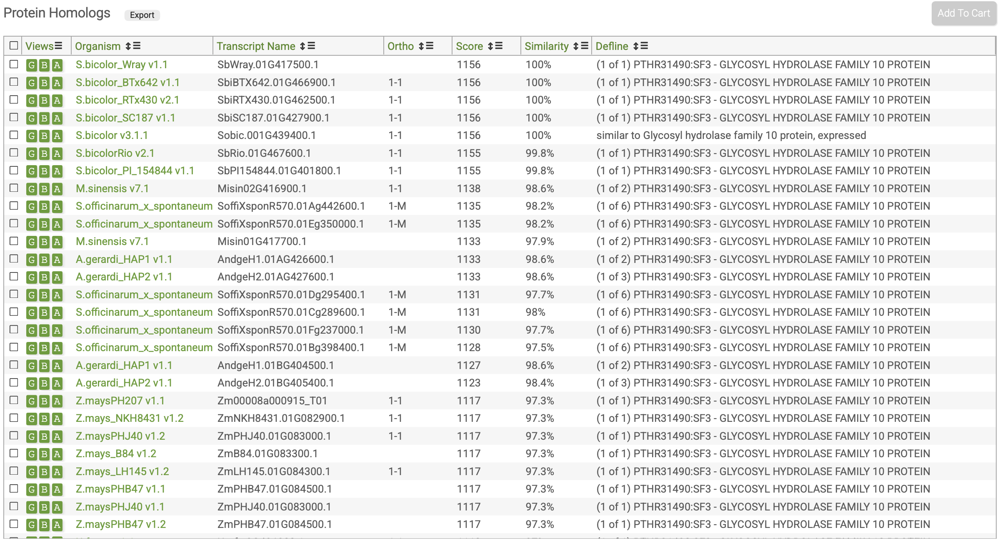

We will perform a [blastp](https://blast.ncbi.nlm.nih.gov/Blast.cgi) search with the [ClusteredNR](https://ncbiinsights.ncbi.nlm.nih.gov/2025/05/22/faster-better-results-protein-blast/?utm_s[]…) algorithm. One often uses a protein sequence when finding homologs in more distantly related species as protein sequences are more conserved than nucleotide sequences.

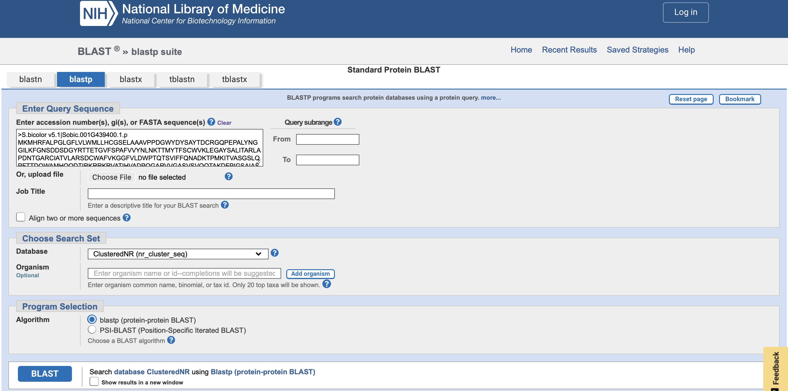

From the blastp results, you can see the clusters of homologs, as well as the cluster's ancestor.

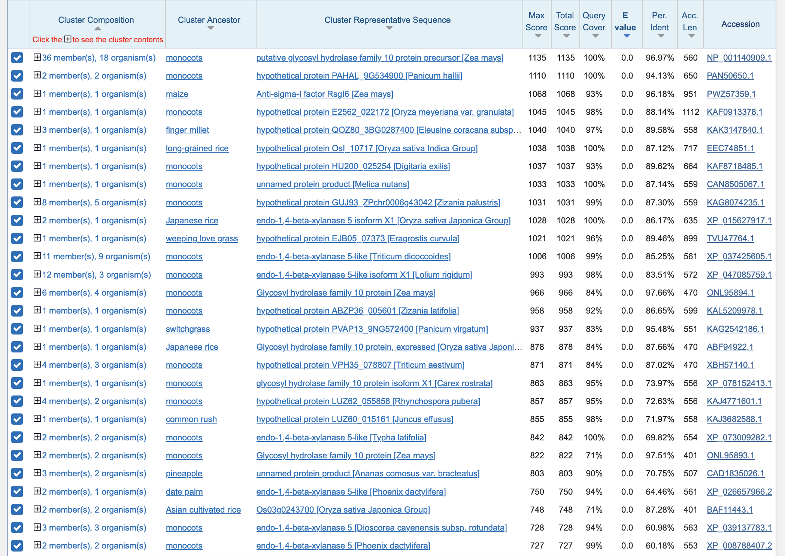

You can expand each cluster to see which species are in the clusters. Here is the most closely related cluster expanded. It makes sense as Sorghum is a grass species, and is a monocot.

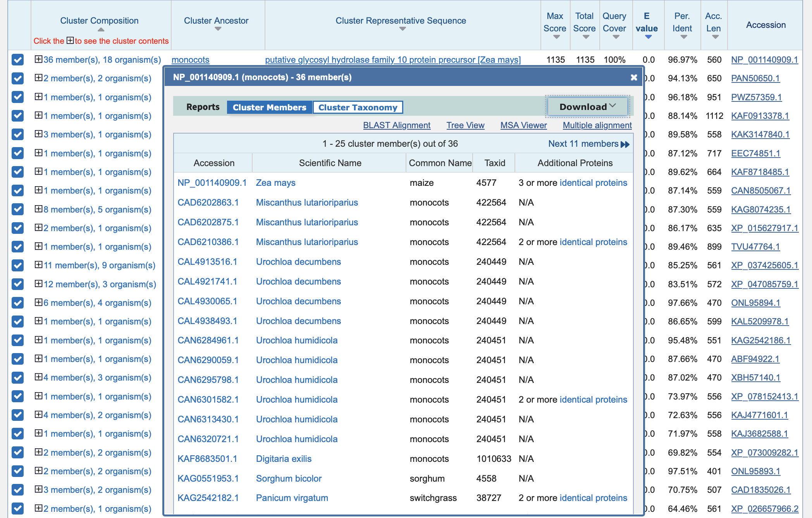

ClusteredNR has introduced a neat feature of being able to create a distance tree of search results, too. This is often gives great insight into the evolutionary history of your protein of interest. For example, one might ask "Is it unique to monocots or dicots? Are there there homologs in other domains of life?" 

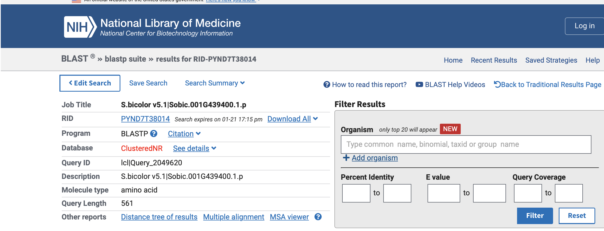

In this tree, you can see that the homologs of `Sobic.001G439400` are in a variety of other plants (this is limited by the number of results from the blastp search parameters. If you want more individuals in the tree, increase the number of sequences included in the results). Homologs in eudicots, monocots, and flowering plants have distinct evolutionary histories. This tree indicates that an ancestral version of this sequence existed before evolution separated monocots, dicots, and eudicots. 

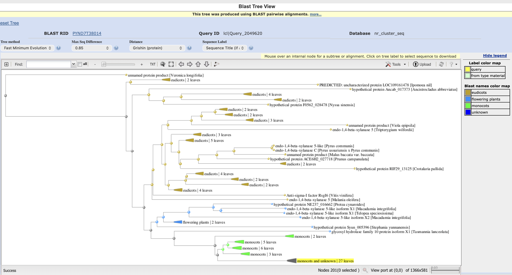

### Domain Annotation

Genomes hosted on Phytozome are incredibly well annotated, but that is not always the case for other databases, or genomes you have assembled yourself. Therefore, we will pretend that we don't know the functional annotation details of this sequence.

We might be interested in the domains contained in this protein. A commonly used tool is [InterProScan](https://www.ebi.ac.uk/interpro/search/sequence/). You can obtain information on a variety of domains, families, and active site prediction. The result is interactive, and you can read more about each domain predicted. InterProScan also predicts GO terms.

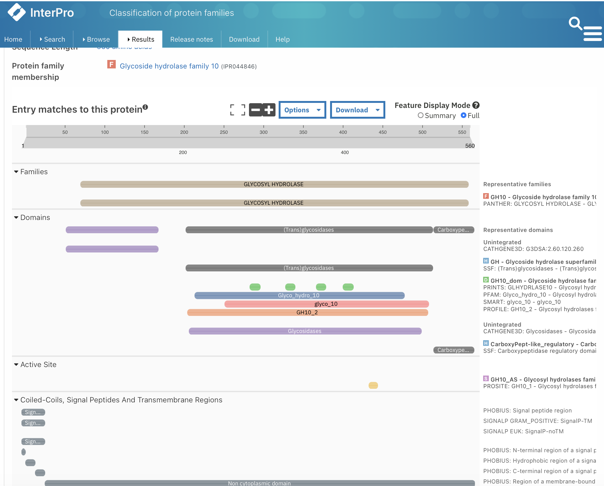

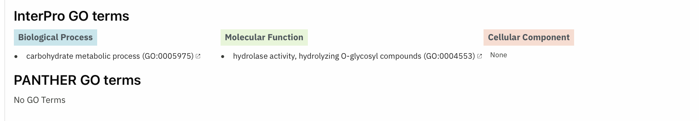

#### More annotations if you need to know more!
You might be interested to know whether there are transmembrane helices (annotate with [DeepTMHMM](https://dtu.biolib.com/DeepTMHMM)), or a signal peptide domain to ensure the protein is secreted (annotate with [SignalP](https://services.healthtech.dtu.dk/services/SignalP-6.0/). Deeploc2 also incorportates SignalP). You might also be curious about subcellular localisation (annotate with [Deeploc](https://services.healthtech.dtu.dk/services/DeepLoc-2.0/))

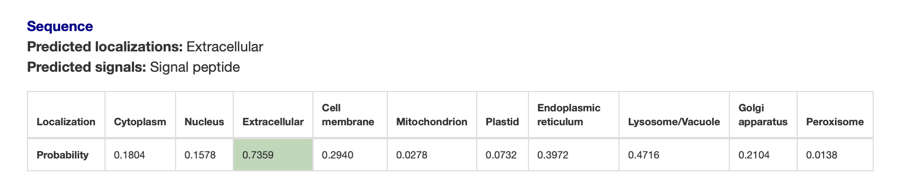

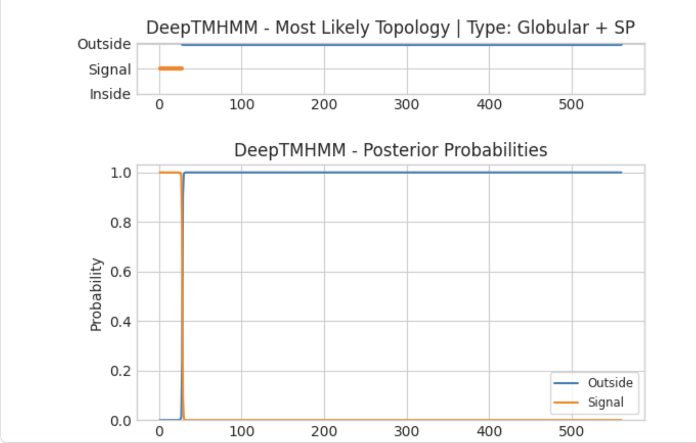

### 3D Structure Prediction

We could be interested in the 3D structure of the protein. We can use [AlphaFold](https://alphafold.ebi.ac.uk) or [SWISSMODEL](https://swissmodel.expasy.org) to predict the 3D structure from the protein sequence. The low confidence tail sticking out from the protein is at the start of the protein. SignalP/Deeploc2 has determined that this is the signal peptide region, and will be cleaved off when the protein is secreted.

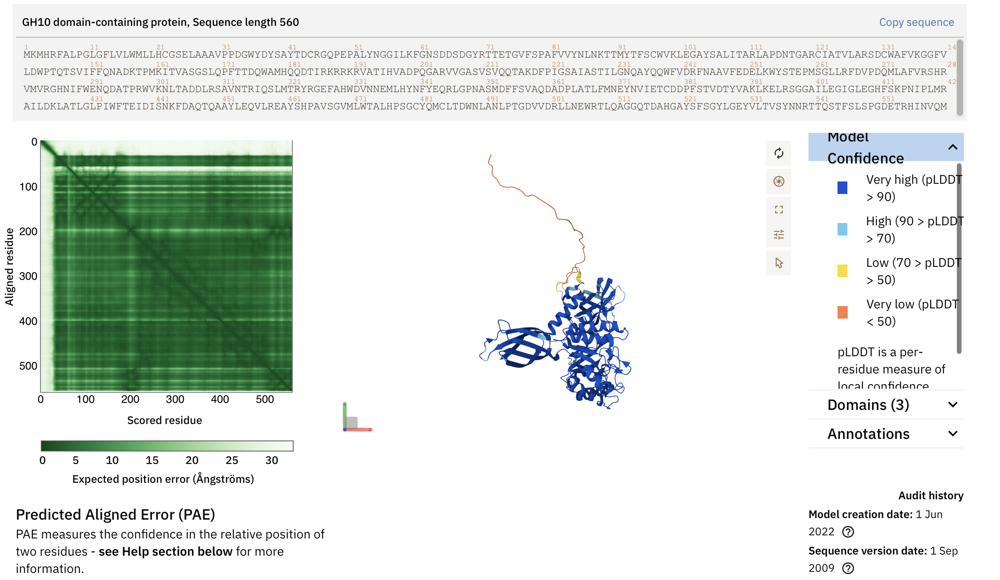

## Overview

With this analysis, we found the protein sequence as well as homologs in other plant species. We annotated domains of interest and found this protein to belong to the glycoside hydrolase (GH) 10 family. We showed that the protein likely contains a signal peptide region, and is secreted outside of the Sorghum cells. All from a gene name!